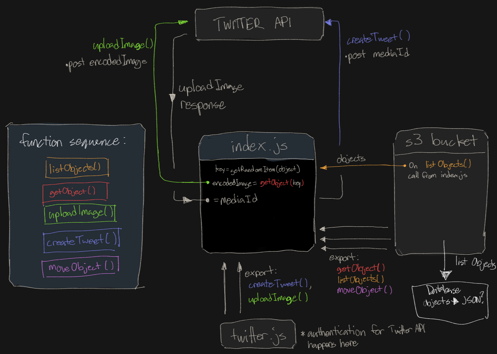

# cat-bot

https://twitter.com/daily_cat_bot

Twitter bot that tweets images from a S3 bucket on a defined time interval

## Background

The bot randomly chooses an image from a manually catered set and tweets it. Simple! The entire application is hosted in AWS, and the only manual intervention involves uploading the images to a `staging` folder, where it waits its turn to be tweeted.

Here's how the AWS services are utilized:

| AWS Service | Usage |
| --- | --- |
| Lambda | This is where the bot's code implementation lives. The lambda orchestrates S3 and Twitter calls. |
| S3 | Images are stored here. The `staging` folder contains images waiting to be tweeted. The `tweeted` folder contains images that have been successfully tweeted. |
| EventBridge | A rule schedules calls to the lambda based on a `cron` expression. Essentially, this controls when tweets are posted. Note: this was formaly done in CloudWatch. |

TODO - sequence diagrams

## Local Development

### Prerequisites

Setup `node`:
```
nvm install 14.19.2
nvm use 14.19.2
```
Setup `direnv`:
- https://github.com/direnv/direnv
- Windows specific steps: https://gist.github.com/rmtuckerphx/4ace28c1605300462340ffa7b7001c6d

Setup local environment variables:
1. Using the sample, create your `.envrc` file (don't commit this!):
    ```
    cp .envrc_sample .envrc
    ```
2. Edit your `.envrc` file by replacing `add_me` with your desired values
3. Load your environment:
    ```
    direnv allow
    ```

### Scripts

Running the code locally (this mimics a lamnda running in AWS):
```
npm run dev-test
```

Running the unit tests:
```
npm t
```

Running the linter:
```
npm run lint
```

## Uploading pictures from local /uploads/ folder to s3 bucket

Create a folder `/uploads/` in the first level of your cat-bot directory. Fill this folder with pictures of cats.  Then run the following comand:
```
npm run full-send
```
Your cat pictures have meow been uploaded to the cat-bot s3 bucket!

## Configuration

The [`.envrc_sample`](.envrc_sample) contains configuration values that are used by the lambda and for local development convenience.

| Name | Description | Required |
| --- | --- | --- |
| TWITTER_CONSUMER_KEY | Used to authenticate against the Twitter developer app. | Yes |
| TWITTER_CONSUMER_SECRET | Used to authenticate against the Twitter developer app. | Yes |
| TWITTER_CLIENT_ID | Used to authenticate against the Twitter user account. | Yes |
| TWITTER_CLIENT_SECRET | Used to authenticate against the Twitter user account. | Yes |
| LOCAL_AWS_ACCESS_KEY_ID | Only used for local development to authenticate against AWS. When this code is run within a lambda, the permissions are gained through its IAM role. | Yes |
| LOCAL_AWS_SECRET_ACCESS_KEY | Only used for local development to authenticate against AWS. When this code is run within a lambda, the permissions are gained through its IAM role. | Yes |
| S3_BUCKET_NAME | S3 bucket name used for storing images. | Yes |
| IS_TWEETING_ENABLED | Feature flag that can be toggled based on local development needs. Defaults to true. | No |
| IS_S3_POST_PROCESSING_ENABLED | Feature flag that can be toggled based on local development needs. Defaults to true. | No |

Including the following variables in [`.envrc_sample`](.envrc_sample) allow the live folders to remain undisturbed while local tests are being performed:
| Variable name | Description | Default value (`index-lambda-cat-bot.js`) | Local value (`.envrc_sample and .envrc`) |
| --- | --- | --- | --- |
| STAGING_FOLDER | Bucket folder where images await to be tweeted | `staging/` | `test-staging/` |
| TWEETED_FOLDER | Bucket folder where images have successfully tweeted | `tweeted/` | `test-tweeted/` |
| QUARANTINE_FOLDER | Bucket folder where images have failed to tweet | `quarantine/` | `test-quarantine/` |

## High level diagram of cat-bot functionality :



## Docs to read:
- Twitter dev docs: https://developer.twitter.com/en/docs/platform-overview
- Reference to setup List/Get/Put S3 permissions: https://github.com/serverless/examples/blob/master/aws-node-fetch-file-and-store-in-s3/serverless.yml
- Node.js and the AWS SDK: https://docs.aws.amazon.com/sdk-for-javascript/v3/developer-guide/getting-started-nodejs.html
